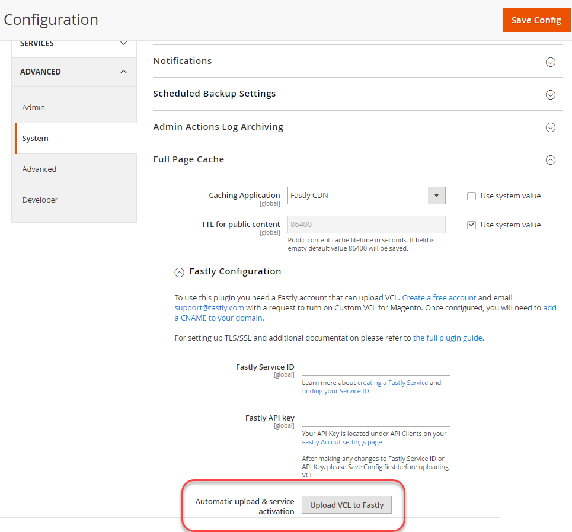

# Services voor snel configureren

Snelheid is vereist voor Adobe Commerce op omgevingen voor het opslaan en produceren van cloudinfrastructuur.

Het werkt snel met Varnish om snelle caching mogelijkheden en een Netwerk van de Levering van de Inhoud (CDN) voor statische activa te verstrekken. Kies deze optie om snel ook een WAF (Web Application Firewall) te maken waarmee u uw site en cloudinfrastructuur kunt beveiligen. Om uw plaats en infrastructuur van de Wolk tegen kwaadwillig verkeer en aanvallen te beschermen, route al inkomend plaatsverkeer door Snelst.

>[!NOTE]
>
>Snelheid is niet beschikbaar in integratieomgevingen.

Voer de volgende stappen uit om uw site snel in te schakelen, te configureren en te testen, zodat u veilig toegang hebt tot uw site.

- Krijg Snelle geloofsbrieven voor het Opvoeren en van de Productie milieu&#39;s
- SNELLE CDN-caching inschakelen
- VCL-fragmenten snel uploaden
- DNS van de update configuratie aan routeverkeer aan de Snelle dienst
- Snelle caching testen

>[!NOTE]
>
>Nadat u de eerste snelconfiguratie hebt ingeschakeld en geverifieerd, kunt u de configuratie aanpassen. U kunt bijvoorbeeld aanvullende opties inschakelen, zoals optimalisatie van afbeeldingen, randmodules en aangepaste VCL-code. Zie [ Cacheconfiguratie ](fastly-custom-cache-configuration.md) aanpassen.

Tijdens projectlevering, voegt Adobe uw project aan de [ Fastly de dienstrekening ](fastly.md#fastly-service-account-and-credentials) voor Adobe Commerce op wolkeninfrastructuur toe en leidt tot de Fastly rekeningsgeloofsbrieven voor de Starter `master` en de milieu&#39;s van de Staging en van de Productie Pro. Elke omgeving heeft unieke referenties.

U hebt de Fastly geloofsbrieven nodig om de Snelle diensten CDN van Admin van Adobe Commerce te vormen en Fastly API verzoeken voor te leggen.

## Snelle toegang tot dashboard voor beheer

Met Adobe Commerce op cloudinfrastructuur hebt u niet rechtstreeks toegang tot het dashboard voor snelbeheer.

U moet de Adobe Commerce-beheerder gebruiken om de configuratie Snelst voor uw omgeving te controleren en bij te werken. Als u geen kwestie kunt oplossen gebruikend de Fastly mogelijkheden in Admin, leg een [ kaartje van de Steun van Adobe Commerce ](https://experienceleague.adobe.com/docs/commerce-knowledge-base/kb/help-center-guide/magento-help-center-user-guide.html?lang=nl-NL#submit-ticket) voor.

## Snelle gebruikersgegevens ophalen

Gebruik de volgende methoden om de Fastly-service-id en API-token voor uw omgeving te zoeken en op te slaan:

**om uw Snelle geloofsbrieven** te bekijken:

>[!NOTE]
>
>Deel uw API-token niet in ondersteuningstickets, openbare forums of openbare locaties. Bovendien moet u geen API-tokens toewijzen aan gegevensopslagruimten: opslagruimten mogen alleen onveranderlijke bestanden zonder vertrouwelijke informatie bevatten.
>
>Adobe Commerce Support heeft al toegang tot de vereiste toetsen, dus u hoeft uw API-token niet te geven wanneer u hulp zoekt.
>
>Als uw API Token ooit openbaar wordt gedeeld of aan een steunkaartje wordt vastgemaakt, zal het als gecompromitteerd worden beschouwd. In dergelijke gevallen is Adobe verplicht een nieuwe token te genereren.
>
>Verwant: [ Fout wanneer het bevestigen van de Fastly geloofsbrieven ](https://experienceleague.adobe.com/nl/docs/commerce-knowledge-base/kb/troubleshooting/miscellaneous/error-when-validating-fastly-credentials#solution)

De methode voor het bekijken van geloofsbrieven is verschillend voor Pro en de projecten van de Aanzet.

- Op IaaS gemonteerde gedeelde folder-op Pro projecten, gebruik SSH om met uw server te verbinden en de Fastly geloofsbrieven van het `/mnt/shared/fastly_tokens.txt` dossier te krijgen. Staging- en productieomgevingen hebben unieke gegevens. U moet de geloofsbrieven voor elke milieu krijgen.

- De lokale werkruimte-van de bevellijn, gebruikt `magento-cloud` CLI aan [ lijst en herzie ](../environment/variables-cloud.md#viewing-environment-variables) snel milieu variabelen.

  ```bash
  magento-cloud variable:get -e <environment-ID>
  ```

- [!DNL Cloud Console] - controleer de volgende omgevingsvariabelen in de [ configuratie van het Milieu ](../project/overview.md#configure-environment).

   - `CONFIG__DEFAULT__SYSTEM__FULL_PAGE_CACHE__FASTLY__FASTLY_API_KEY`

   - `CONFIG__DEFAULT__SYSTEM__FULL_PAGE_CACHE__FASTLY__FASTLY_SERVICE_ID`

>[!NOTE]
>
>Neem contact op met de Adobe Customer Technical Advisor (CTA) als u de gegevens voor de testomgeving of productieomgeving niet snel kunt vinden.

## Snelle caching inschakelen

U hebt de volgende componenten nodig om de Snelle diensten toe te laten en te vormen:

- De recentste versie van [ snelst CDN voor Magento 2 module ](fastly.md#fastly-cdn-module-for-magento-2) wordt geïnstalleerd in de milieu&#39;s van het Staging en van de Productie. Zie [ Snelle Verbetering ](#upgrade-the-fastly-module).

- [ snelste geloofsbrieven ](#get-fastly-credentials) voor Adobe Commerce op de milieu&#39;s van de het Staging en van de Productie van de wolkeninfrastructuur

**om snel CDN toe te laten caching in het Staging en Productie**:

{{admin-login-step}}

1. Klik **Slaat** op > Montages > **Configuratie** > **Geavanceerd** > **Systeem** en breid **het Volledige Geheime voorgeheugen van de Pagina** uit.

   

1. In de _Caching sectie van de Toepassing_, verwijder de selectie uit **het systeemwaarde van het Gebruik**, en selecteer dan **Fastly CDN** van de drop-down lijst.

   

1. Vouw **Snelle Configuratie** uit en [ verkies caching opties ](https://github.com/fastly/fastly-magento2/blob/master/Documentation/CONFIGURATION.md#configure-the-module).

1. Na het vormen van de caching opties, klik **sparen Config** bij de bovenkant van de pagina.

1. Wis het geheime voorgeheugen volgens het bericht.

1. Ga door het vormen van Vluchtelend door terug naar **Opslag** te navigeren > **Montages** > **Configuratie** > **Geavanceerd** > **Systeem** > **Snelle Configuratie**.

### Referenties snel testen

1. Voor Admin, navigeer aan **Slaat** > Montages > **Configuratie** > **Geavanceerd** > **Systeem** > **Vluchteloze Configuratie**.

1. Indien nodig, voeg de **Snelle dienst ID** en **API symbolische** waarden voor uw projectmilieu toe.

   

   >[!NOTE]
   >
   >Selecteer niet de koppeling waarmee u het snelheids-API-token wilt maken. In plaats daarvan, gebruik de [ Snelle geloofsbrieven (identiteitskaart van de Dienst en API teken) die door Adobe ](#get-fastly-credentials) worden verstrekt.

1. Klik **geloofsbrieven van de Test**.

1. Als de test slaagt, klik **sparen Config**, en ontruim dan het geheime voorgeheugen.

   Als de test ontbreekt, verifieer dat de correcte dienst ID en de symbolische waarden van API de geloofsbrieven voor het huidige milieu aanpassen.

   Als de test opnieuw mislukt, verzendt u een Adobe Commerce-ondersteuningsticket of neemt u contact op met uw Adobe-accountvertegenwoordiger. Neem voor Pro-projecten de URL&#39;s op voor uw productie- en staging-sites. Neem voor Starter-projecten de URL&#39;s voor uw `Master` - en Staging-site op.

>[!NOTE]
>
>Voor instructies om snel API symbolische geloofsbrieven voor een het Opvoeren of milieu van de Productie te veranderen, zie [ Verandering de Snelle geloofsbrieven ](fastly.md#change-fastly-api-token).

### VCL snel uploaden naar

Nadat u de Fastly module toelaat, upload de standaard [ code VCL ](https://github.com/fastly/fastly-magento2/tree/master/etc/vcl_snippets) aan de Snelste servers. Deze code verstrekt een reeks fragmenten VCL die de configuratiemontages specificeren om caching en andere snel CDN diensten voor uw Adobe Commerce op wolkeninfrastructuur toe te laten.

>[!NOTE]
>
>De services voor het snel in cache plaatsen werken pas wanneer u de eerste upload van de Fastly VCL-code naar de Adobe Commerce Staging and Production-sites hebt voltooid.

**om Fastly VCL** te uploaden:

1. In de _Snelle sectie van de Configuratie_, klik **uploadt VCL aan Fastly** aangezien het volgende cijfer toont.

   

1. Nadat het uploaden is voltooid, vernieuwt u de cache volgens het bericht boven aan de pagina.

## SSL/TLS-certificaten leveren

Adobe biedt een door domein gevalideerd SSL/TLS-certificaat waarmee snel veilig HTTPS-verkeer kan worden aangeboden. Adobe verstrekt één certificaat voor elke ProProductie, Staging, en het milieu van de Productie van de Aanzet om alle domeinen in dat milieu te beveiligen. Voor gedetailleerde informatie over het verstrekte certificaat, zie [ SSL van Adobe (TLS) certificaten voor Adobe Commerce op wolkeninfrastructuur ](https://experienceleague.adobe.com/docs/commerce-knowledge-base/kb/how-to/ssl-tls-certificates-for-magento-commerce-cloud-faq.html?lang=nl-NL).

>[!NOTE]
>
>U kunt uw eigen TLS- of SSL-certificaat opgeven in plaats van het Let&#39;s Encrypt-certificaat van Adobe te gebruiken. Dit proces vereist echter extra werk om op te zetten en te onderhouden. Als u deze optie wilt kiezen, dient u een Adobe Commerce-ondersteuningsticket in of werkt u met Adobe om aangepaste, gehoste certificaten toe te voegen aan uw Adobe Commerce in omgevingen met cloudinfrastructuur.

Om de SSL/TLS-certificaten in te schakelen voor Adobe Commerce-omgevingen, voert Adobe de volgende stappen uit:

- Valideert domeineigendom
- Bevat een SSL/TLS-certificaat dat specifieke top-level en subdomeinen voor uw winkels dekt.
- Hiermee wordt het certificaat geüpload naar de cloud-omgeving als de site live is

Deze automatisering vereist u om de DNS configuratie voor uw plaats bij te werken om de informatie van de domeinbevestiging te leveren. Gebruik **één** van de volgende methodes:

- **DNS bevestiging** - voor levende plaatsen, werk uw DNS configuratie met CNAME verslagen bij die aan de Snelle dienst richten
- **ACME verslagen van de uitdagingCNAME** - werk uw DNS configuratie met de verslagen van de uitdagingCNAME van de ACME bij die door Adobe voor elk domein in uw milieu worden verstrekt

>[!TIP]
>
>Als u een Productiedomein hebt dat niet actief is, gebruik de ACME verslagen van uitdagingCNAME voor domeinbevestiging. Als u de records eerder toevoegt aan uw DNS-configuratie, kan Adobe het SSL/TLS-certificaat voorzien van de juiste domeinen voordat de site wordt gestart. Voordat u het product kunt gaan maken, moet u deze plaatsaanduidingsrecords vervangen door de CNAME-records die door Adobe worden geleverd.

Wanneer domeinvalidatie is voltooid, biedt Adobe het Let&#39;s Encrypt TLS/SSL-certificaat en uploadt het naar live testomgeving of productieomgeving. Dit proces kan tot 12 uur duren. Wij adviseren dat u de DNS configuratieupdates verscheidene dagen vooraf voltooit om vertragingen in plaatsontwikkeling en plaatslancering te verhinderen.

## DNS-configuratie bijwerken met ontwikkelinstellingen

Tijdens het eerste Fastly opstellingsproces, kunt u de volgende URLs gebruiken om Fastly caching in het Opvoeren van het Staging en de milieu&#39;s van de Productie te vormen en te testen:

- Voor Pro Staging en Productie:

   - `mcprod.<your-domain>.com`
   - `mcstaging.<your-domain>.com`

- Uitsluitend voor startproductie:

   - `mcprod.<your-domain>.com`

Deze standaard pre-productie URLs is beschikbaar nadat uw project wordt provisioned. De waarde voor `"your-domain"` is de domeinnaam die u tijdens het instapproces hebt opgegeven.

>[!NOTE]
>
>U kunt geen douanedomein voor een niet productiemilieu op de projecten van de Aanzet specificeren.

Om verkeer van uw opslag URLs aan de Snelle dienst te leiden werkt uw DNS configuratie bij. Wanneer u de configuratie bijwerkt, voorziet Adobe automatisch van de vereiste SSL/TLS-certificaten en uploadt het deze naar uw Cloud-omgevingen. Deze provisioning kan tot 12 uur duren.

>[!NOTE]
>
>Wanneer u bereid bent om uw plaats van de Productie te lanceren, moet u de DNS configuratie opnieuw bijwerken om uw productiedomeinen aan de Snelle dienst te richten en extra configuratietaken te voltooien. Zie [ checklist van de Lancering ](../launch/checklist.md).

**Eerste vereisten:**

- Schakel de module Snelheid in.
- Upload de standaard VCL-code snel.
- Geef een lijst met top-level en subdomeinen op voor elke omgeving naar Adobe of verzend een Adobe Commerce Support-ticket.
- Wacht op bevestiging dat de opgegeven domeinen zijn toegevoegd aan uw Cloud-omgevingen.
- Voor de projecten van de Aanzet, voeg de domeinen aan uw Snelle de dienstconfiguratie toe. Zie [ domeinen ](fastly-custom-cache-configuration.md#manage-domains) beheren.
- Voor informatie over het bijwerken van de DNS configuratie, controleer met uw [ DNS registrar ](https://lookup.icann.org/) voor de correcte methode voor uw domeindienst.

**om uw DNS configuratie voor ontwikkeling** bij te werken:

1. Punt pre-productie URLs aan de Fastly dienst door CNAME verslagen toe te voegen: `prod.magentocloud.map.fastly.net`, bijvoorbeeld:

   | Domein of Subdomein | CNAME |
   |---------------------------|----------------------------------|
   | mcprod.your-domain.com | prod.magentocloud.map.fastly.net |
   | mcstaging.your-domain.com | prod.magentocloud.map.fastly.net |

   Als de CNAME-records live zijn, worden certificaten door Adobe geleverd en worden de SSL/TLS-certificaten geüpload.

   >[!NOTE]
   >
   >Als u van plan bent om apex domeinen (`your-domain.com`) voor uw plaats van de Productie te gebruiken, moet u DNS adresverslagen (A verslagen) vormen om aan de Snelle serverIP adressen te richten. Zie [ DNS configuratie van de Update met productiemontages ](../launch/checklist.md#to-update-dns-configuration-for-site-launch).


1. Voeg de verslagen van de uitdagingCNAME van de ACME voor domeinbevestiging en pre-provisioning van de certificaten van de Productie SSL/TLS toe, bijvoorbeeld:

   | Domein of Subdomein | CNAME |
   |-------------------------------------------|-------------------------------------------|
   | _acme-challenge.your-domain.com | 0123456789abcdef.validation.magento.cloud |
   | _acme-challenge.www.your-domain.com | 9573186429stuvwx.validation.magento.com |
   | _acme-challenge.mystore.your-domain.com | 1234567898zxywvu.validation.magento.cloud |
   | _acme-challenge.subdomain.your-domain.com | 1098765743lmnopq.validation.magento.cloud |

   >[!NOTE]
   >
   >De ACME-aanvraagdossiers in dit voorbeeld zijn plaatsaanduidingen die niet bedoeld zijn om uw Adobe Commerce-opbouw- en productiesites te voorzien. Neem contact op met Adobe om de juiste gegevens van de ACME-uitdagingsrecord voor uw project op te halen.

   Nadat Adobe de CNAME-records heeft toegevoegd, valideert het de domeinen en voorzieningen van het SSL/TLS-certificaat voor de omgeving. Wanneer u de DNS configuratie aan routeverkeer van deze domeinen aan de Snelle dienst bijwerkt, uploadt Adobe het certificaat aan het milieu.

1. Werk de Adobe Commerce Base-URL bij.

   - Gebruik SSH om u aan te melden bij de productieomgeving.

     ```bash
     magento-cloud ssh
     ```

   - Met de Cloud CLI kunt u de basis-URL voor uw winkel wijzigen.

     ```bash
     php bin/magento setup:store-config:set --base-url="https://mcstaging.your-domain.com/"
     ```

   >[!NOTE]
   >
   >Als alternatief aan het gebruiken van Cloud CLI, kunt u Basis URL van [ Admin ](https://experienceleague.adobe.com/docs/commerce-admin/stores-sales/site-store/store-urls.html?lang=nl-NL) bijwerken

1. Start de webbrowser opnieuw.

1. Test uw website.

## Snelle caching testen

Nadat u de DNS configuratieveranderingen voltooit, gebruik [ cURL ](https://curl.se/) bevel-lijn hulpmiddel om te verifiëren dat het geheime voorgeheugen van de Fastly werkt.

**om de reactiekopballen** te controleren:

1. Gebruik in een terminal de volgende `curl` opdracht om de URL van uw livesite te testen:

   ```bash
   curl -vo /dev/null -H Fastly-Debug:1 https://<live-URL>
   ```

   Als u geen statische route hebt geplaatst of de DNS configuratie voor de domeinen op uw levende plaats voltooid, gebruik de `--resolve` vlag, die DNS naamresolutie overslaat.

   ```bash
   curl -vo /dev/null -H Fastly-Debug:1 --resolve <live-URL-hostname>:443:<live-IP-address>
   ```

1. In de reactie, verifieer de [ kopballen ](fastly-troubleshooting.md#check-cache-hit-and-miss-response-headers) om ervoor te zorgen dat de Fastly werkt. De volgende unieke kopteksten worden weergegeven in het antwoord:

   ```http
   < Fastly-Magento-VCL-Uploaded: yes
   < X-Cache: HIT, MISS
   ```

Als de kopballen niet de correcte waarden hebben, zie [ fouten oplossen die in de antwoordkopballen ](fastly-troubleshooting.md#curl) voor het oplossen van problemenhulp worden gevonden.

## De module Snelheid upgraden

Hiermee werkt u de snelst CDN voor de Magento 2-module bij om problemen op te lossen, de prestaties te verbeteren en nieuwe functies te bieden.
Wij adviseren dat u de Fastly module in uw het Opvoeren en milieu&#39;s van de Productie aan de [ recentste versie ](https://github.com/fastly/fastly-magento2/blob/master/VERSION) bijwerkt.

Nadat u de module bijwerkt, moet u de code uploaden VCL om de veranderingen op de Fastly de dienstconfiguratie toe te passen.

>[!WARNING]
>
> Als u de standaard snelle VCL-code hebt aangepast met een aangepaste versie, overschrijft de upgrade van de module Snelheid uw wijzigingen. Als u aangepaste VCL-fragmenten met unieke namen hebt toegevoegd, blijven deze wijzigingen behouden tijdens het upgradeproces. Als beste praktijken, bevorder de het Opvoeren milieu en bevestig de veranderingen alvorens veranderingen in het milieu van de Productie toe te passen.

**om de versie van Fastly CDN module voor Magento 2** te controleren:

1. Ga naar de hoofdmap van de cloud-omgeving.

1. Gebruik Composer om de geïnstalleerde versie te controleren.

   ```bash
   composer show *fastly*
   ```

1. Als de [ recentste versie ](https://github.com/fastly/fastly-magento2/releases) niet geïnstalleerd is, voltooi de stappen om de Fastly module te bevorderen.

**om de Fastly module** te bevorderen:

1. In uw lokale integratiemilieu, gebruik de volgende moduleinformatie om [ de Snelle module ](../store/extensions.md#upgrade-an-extension) te bevorderen.

   ```text
   module name: fastly/magento2
   repository: https://github.com/fastly/fastly-magento2.git
   ```

1. Verhoog uw updates naar de testomgeving.

1. Login aan Admin voor uw het Opvoeren milieu aan [ uploadt de code VCL ](#upload-vcl-to-fastly).

1. [ verifieer de Snelle diensten ](fastly-troubleshooting.md#verify-or-debug-fastly-services) op de het Staging plaats van Adobe Commerce.

Nadat u de Snelle diensten op de Staging plaats verifieert, herhaal het verbeteringsproces in het milieu van de Productie.

>[!TIP]
>
> Als u kwesties met de Snelle diensten in uw milieu&#39;s van Adobe Commerce hebt, zie [ snel de probleemoplosser van Adobe Commerce ](https://experienceleague.adobe.com/docs/commerce-knowledge-base/kb/troubleshooting/miscellaneous/magento-fastly-troubleshooter.html?lang=nl-NL).
