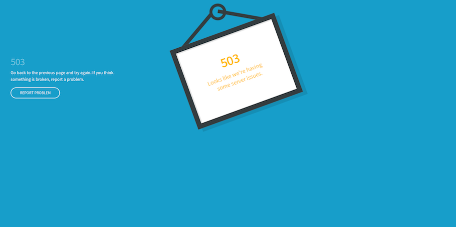

# Fout- en onderhoudspagina&#39;s aanpassen

Wanneer een verzoek aan de Fastly oorsprong ontbreekt, keert de Snelle standaardreactiepagina&#39;s met basis het formatteren en generische overseinen terug die voor gebruikers kunnen verwarren. Bijvoorbeeld, kort keert de volgende standaardfoutenpagina terug wanneer een verzoek aan de Fastly oorsprong wegens een fout 503 ontbreekt.


U kunt uw Adobe Commerce-winkelconfiguratie bijwerken en zo sommige standaardresponspagina&#39;s vervangen door pagina&#39;s met vriendelijker berichten en verbeterde HTML-opmaak, zoals in het volgende voorbeeld wordt getoond.



Momenteel kunt u de volgende snelstresponspagina&#39;s aanpassen voor uw Adobe Commerce-project voor cloudinfrastructuur.

- [Serverfouten - Interne serverfout, time-out of uitval van siteonderhoud (foutcode 500 of hoger)](#customize-the-503-error-page)
- [WAF-blokkeringsgebeurtenissen die optreden wanneer de WAF verdachte aanvraagberichten detecteert (403 Verboden)](#customize-the-waf-error-page)

**HTML coderingsvereisten:**

De HTML-code voor de aangepaste pagina moet aan de volgende vereisten voldoen:

- Inhoud kan maximaal 65.535 tekens bevatten.
- Geef alle CSS inline op in de HTML-bron.
- Bundel afbeeldingen op de pagina HTML met base64, zodat ze ook worden weergegeven als Fastly offline is. Zie [ Gegevens URIs op de css-tricks plaats ](https://css-tricks.com/data-uris/).

## De pagina met 503 fouten aanpassen

Klanten zien de standaardpagina met 503 fouten in de volgende gevallen:

- Wanneer een verzoek aan de snelste oorsprong een reactiestatus groter dan 500 terugkeert
- Wanneer de Fastly oorsprong neer is, zoals een onderbreking, onderhoudsactiviteit of gezondheidskwesties

U kunt de standaardpagina aanpassen door de volgende HTML-code aan te passen en de opmaak aan te passen aan het Adobe Commerce-winkelthema en de titel en het bericht indien nodig aan te passen.

```html
<!DOCTYPE html>
<html>
   <head>
      <meta charset="UTF-8">
         <title>503</title>
   </head>
   <body>
      <p>Service unavailable</p>
   </body></html>
```

Controleer of de gewijzigde bron correct wordt weergegeven in de browser. Voeg vervolgens de aangepaste HTML-code toe aan de configuratie Snelst.

De aangepaste reactiepagina toevoegen aan de snelconfiguratie:

{{admin-login-step}}

1. Selecteer **>** Montages **>** Configuratie **>** Geavanceerd **>** Systeem **.**

1. In de juiste ruit, breid **het Volledige Geheime voorgeheugen van de Pagina uit** Snelle Configuratie **>** de Synthetische Pagina&#39;s van de Douane **.**

    uit

1. Selecteer **Vastgestelde HTML**.

1. Kopieer en plak de broncode voor de aangepaste reactiepagina in het veld HTML.

   

1. Selecteer **uploaden** bij de bovenkant van de pagina om de aangepaste bron van HTML aan de Snelste server te uploaden.

1. Selecteer **sparen Config** bij de bovenkant van de pagina om het bijgewerkte configuratiedossier te bewaren.

1. Vernieuw de cache.

   - In het bericht bij de bovenkant van de pagina, selecteer de *verbinding van het Beheer van het Geheime voorgeheugen*.

   - Voor de pagina van het Beheer van het Geheime voorgeheugen, uitgezochte **het Geheime voorgeheugen van het Magento**.

## De WAF-foutpagina aanpassen

De klanten zien de volgende standaard de foutenpagina van WAF wanneer een verzoek aan de Fastly oorsprong met een `403 Forbidden` fout ontbreekt die door a [ wordt veroorzaakt WAF ](fastly-waf-service.md) blokkerende gebeurtenis.


In het volgende codevoorbeeld wordt de HTML-bron voor de standaardpagina getoond:

```html
<html>
  <head>
    <title>Magento 403 Forbidden</title>
  </head>
  <body>
    <p>The requested URL was rejected.</p>
    <p>For additional information, please contact support and provide this reference ID:</p>
    <p>"} req.http.x-request-id {"</p>
    <p><button onclick='history.back();'>Go Back</button></p>
  </body>
</html>
```

U kunt de **Synthetische Pagina&#39;s van de Douane gebruiken** > **geeft de pagina van WAF** optie in het Snelle configuratiemenu uit om de standaardcode voor uw Adobe Commerce op het project van de wolkeninfrastructuur aan te passen. Wanneer u de code bewerkt, behoudt u de volgende regel met de referentie-id voor de WAF-blokkeringsgebeurtenis:

```html
<p>"} req.http.x-request-id {"</p>
```

>[!NOTE]
>
>De optie WAF bewerken is alleen beschikbaar als de service Beheerde Cloud WAF is ingeschakeld voor uw Adobe Commerce-infrastructuurproject in de cloud.

**om de de foutenpagina van WAF uit te geven**:

1. [ Login aan Admin ](../../get-started/onboarding.md#access-your-admin-panel).

1. Selecteer **>** Montages **>** Configuratie **>** Geavanceerd **>** Systeem **.**

1. In de juiste ruit, breid **het Volledige Geheime voorgeheugen van de Pagina uit** Snelle Configuratie **>** de Synthetische Pagina&#39;s van de Douane **.**

    uit

1. Selecteer **uitgeven de pagina van WAF**.

1. Vul de velden in om de HTML bij te werken.

   

   - **Status** - selecteer de `403 Forbidden` status.
   - **MIME type** — Type `text/html`.
   - **Inhoud** — geef de standaardreactie van de HTML uit om douane CSS toe te voegen en de titel en het overseinen bij te werken zoals nodig.

1. Selecteer **uploaden** bij de bovenkant van de pagina om de aangepaste bron van HTML aan de Snelste server te uploaden.

1. Selecteer **sparen Config** bij de bovenkant van de pagina om het bijgewerkte configuratiedossier te bewaren.

1. Vernieuw de cache.

   - In het bericht bij de bovenkant van de pagina, selecteer de **verbinding van het Beheer van het Geheime voorgeheugen**.

   - Voor de pagina van het Beheer van het Geheime voorgeheugen, uitgezochte **het Geheime voorgeheugen van het Magento**.

## Foutrapportnummer weergeven

Door gebrek, verbergt de Fastly alle fouten van Adobe Commerce achter de *503 niet beschikbare* fout van de Dienst. Als u het rapportnummer van het foutenlogboek wilt weergeven, zodat u de foutdetails in de logboeken kunt vinden en bekijken, opent u de website zonder dat u snel de volgende stappen uitvoert:

1. Haal het IP-adres van uw winkel op:

   - Voor Pro Staging- en Productieomgevingen:

     ```bash
     nslookup {your_project_id}.ent.magento.cloud
     ```

   - Voor Pro-integratieomgevingen en Starter-omgevingen:

     ```bash
     nslookup gw.{your_region}.magentosite.cloud
     ```

1. Voeg uw toepassingsdomein en IP adres aan het gastheerdossier op uw lokale werkstation toe:

   ```text
   {server_IP} {store_domain}
   ```

1. Wis de browsercache en cookies (of schakel over naar de incognitomodus).

1. Open de website van uw winkel opnieuw om de foutcode weer te geven.

1. Gebruik de foutcode om de details in het foutrapportbestand te zoeken:

   - [Verbinding maken met de desbetreffende omgeving met behulp van SSH](../development/secure-connections.md#connect-to-a-remote-environment)

   - Zoek het `./var/report/{error_number}` -bestand.
