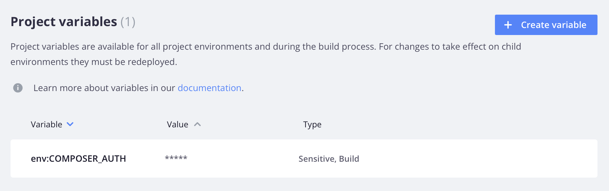

# Variabele niveaus

De variabelen van het project zijn op alle milieu&#39;s binnen het project van toepassing. Omgevingsvariabelen zijn van toepassing op een specifieke omgeving of vertakking. Een milieu _erft_ veranderlijke definities van het oudermilieu.

U kunt een overgeërfde waarde met voeten treden door de variabele specifiek voor het milieu te bepalen. Als u bijvoorbeeld variabelen wilt instellen voor ontwikkeling, definieert u de waarden van variabelen in het `.magento.env.yaml` -bestand in de integratieomgeving. Alle omgevingen die vertakkingen ondervinden van de integratieomgeving nemen deze waarden over. Zie [ configuratie van de Plaatsing ](configure-env-yaml.md) voor details over het vormen van uw milieu gebruikend het `.magento.env.yaml` dossier.

>[!BEGINTABS]

>[!TAB  CLI ]

**om variabelen te plaatsen gebruikend Cloud CLI**:

- **project-specifieke variabelen** - om de zelfde waarde voor _alle_ milieu&#39;s in uw project te plaatsen. Deze variabelen zijn beschikbaar bij het samenstellen en uitvoeren in alle omgevingen.

  ```bash
  magento-cloud variable:create --level project --name <variable-name> --value <variable-value>
  ```

- **milieu-specifieke variabelen** - om een unieke waarde voor a _specifiek_ milieu te plaatsen. Deze variabelen zijn beschikbaar bij uitvoering en worden overgeërfd door onderliggende omgevingen. Geef de omgeving in de opdracht op met de optie `-e` .

  ```bash
  magento-cloud variable:create --level environment --name <variable-name> --value <variable-value>
  ```

Nadat u projectspecifieke variabelen hebt ingesteld, moet u de externe omgeving handmatig opnieuw implementeren voordat de wijziging van kracht wordt. Duw de nieuwe verplichtingen om een herplaatsing teweeg te brengen.

>[!TAB  Console ]

**om variabelen te plaatsen gebruikend[!DNL Cloud Console]**:

1. Klik in _[!DNL Cloud Console]_&#x200B;op het configuratiepictogram rechts van de projectnavigatie.

   {width="36"}

1. Om een project-vlakke variabele te plaatsen, onder _de Montages van het Project_ klikt **Variabelen**.

   

1. Om een milieu-vlakke variabele, in de _lijst van Milieu&#39;s_ te plaatsen, selecteer een milieu en klik het **[!UICONTROL Variables]** lusje.

   

1. Klik op **[!UICONTROL Create variable]**.

1. Geef een naam en waarde voor de variabele op. Kies een van de volgende opties:

   - Beschikbaar tijdens runtime
   - Beschikbaar tijdens buildtijd
   - JSON-waarde
   - Gevoelige variabele (waarde verborgen in de console en CLI reacties)
   - Overerving mogelijk maken (onderliggende omgevingen kunnen omgevingspremies overerven)

1. Klik op **[!UICONTROL Create variable]**.

>[!CAUTION]
>
>Door omgevingsspecifieke variabelen in te stellen in [!DNL Cloud Console] wordt de omgeving automatisch opnieuw geïmplementeerd.

>[!ENDTABS]

## Zichtbaarheid

Met de opdracht `--visible-<build|runtime>` kunt u de zichtbaarheid van een variabele tijdens het maken of uitvoeren beperken. Er zijn ook opties om overerving en gevoeligheid in te stellen.

Gebruik de volgende opties om te voorkomen dat een variabele wordt gezien of overgeërfd:

- `--inheritable false` - schakelt overerving voor onderliggende omgevingen uit. Dit is nuttig om productie-enige waarden op de `master` tak te plaatsen en alle andere milieu&#39;s toe te staan om een project-vlakke variabele van de zelfde naam te gebruiken.
- `--sensitive true` - merkt de variabele als _niet-leesbaar_ in [!DNL Cloud Console]. U kunt de variabele niet weergeven in de gebruikersinterface, maar u kunt de variabele wel vanuit de toepassingscontainer bekijken, net als elke andere variabele.

Hieronder ziet u een specifiek geval waarin wordt voorkomen dat een variabele wordt gezien of overgeërfd. U kunt deze opties slechts in CLI specificeren. Dit geval heeft niet betrekking op alle beschikbare omgevingsvariabelen.

```bash
magento-cloud variable:create --name <variable-name> --value <variable-value> --inheritable false --sensitive true
```

## Variabeleniveaus en -waarden verifiëren

U kunt een lijst met bestaande variabelen weergeven met de CLI van de cloud.

```bash
magento-cloud variables
```

```
Variables on the project Project-Name (<project-id>), environment <environment-name>:
+----------------------------+-------------+-------------------------------------------+
| Name                       | Level       | Value                                     |
+----------------------------+-------------+-------------------------------------------+
| env:COMPOSER_AUTH          | project     | {                                         |
|                            |             |    "http-basic": {                        |
|                            |             |       "repo.magento.com": {               |
|                            |             |       "username":                         |
|                            |             | "<public-key>",                           |
|                            |             |       "password":                         |
|                            |             | "<private-key>"                           |
|                            |             |     }                                     |
|                            |             |   }                                       |
|                            |             | }                                         |
| ADMIN_EMAIL                | project     | admin@123.com                             |
| ADMIN_EMAIL                | environment | admin@123.com                             |
| ADMIN_PASSWORD             | environment | password                                  |
| ADMIN_URL                  | environment | admin123                                  |
| ADMIN_USERNAME             | environment | admin                                     |
| php:newrelic.license       | environment | xxxx71fb030366182117f955a22e4baf8exxxxxx  |
+----------------------------+-------------+-------------------------------------------+
```
