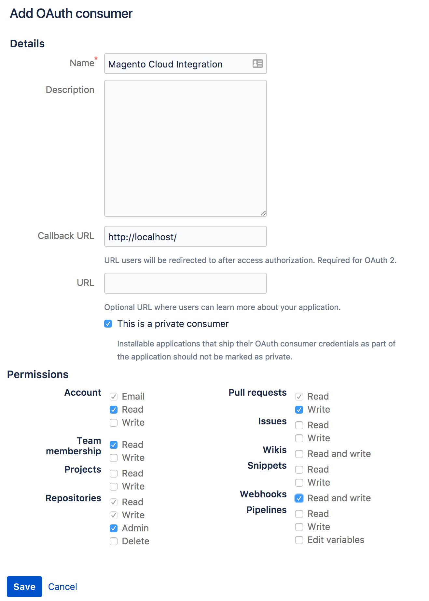

# Bitmap-integratie

U kunt uw opslagplaats van Bitbucket vormen om automatisch een milieu te bouwen en op te stellen wanneer u codeveranderingen duwt. Deze integratie synchroniseert uw Bitmap-opslagplaats met uw Adobe Commerce op een cloud-infrastructuuraccount.

{{private-repository}}

## Vereisten

- Beheerderstoegang tot de Adobe Commerce in het infrastructuurproject voor de cloud
- [`magento-cloud` CLI &#x200B;](../dev-tools/cloud-cli-overview.md) in uw lokale omgeving
- Een Bitmap-account
- Beheerderstoegang tot de opslagplaats van Bitmap
- Een SSH-toegangstoets voor de Bitmap-opslagplaats

## De opslagplaats voorbereiden

Clone your Adobe Commerce on cloud Infrastructure project from an existing environment and migrate the project Branches to a new, empty Bitbucket repository, preserve the same taknames. Het is kritiek **om een identieke boom van het Git te behouden, zodat u geen bestaande milieu&#39;s of takken in uw Adobe Commerce op het project van de wolkeninfrastructuur verliest.**

1. Meld u vanaf de terminal aan bij uw Adobe Commerce voor een infrastructuurproject voor de cloud.

   ```bash
   magento-cloud login
   ```

1. Maak een lijst van uw projecten en kopieer projectidentiteitskaart

   ```bash
   magento-cloud project:list
   ```

1. Kloont het project naar uw lokale omgeving.

   ```bash
   magento-cloud project:get <project-ID>
   ```

1. Voeg uw opslagplaats van Bitmap toe als ver.

   ```bash
   git remote add origin git@bitbucket.org:<user-name>/<repo-name>.git
   ```

   De standaardnaam voor de externe verbinding kan `origin` of `magento` zijn. Als `origin` bestaat, kunt u een verschillende naam kiezen of u kunt de bestaande verwijzing een andere naam geven of verwijderen. Zie [&#x200B; git-verre documentatie &#x200B;](https://git-scm.com/docs/git-remote).

1. Controleer of u de optie Bitmap op de juiste manier hebt toegevoegd.

   ```bash
   git remote -v
   ```

   Verwacht antwoord:

   ```
   origin git@bitbucket.org:<user-name>/<repo-name>.git (fetch)
   origin git@bitbucket.org:<user-name>/<repo-name>.git (push)
   ```

1. Verplaats de projectbestanden naar de nieuwe Bitmap-opslagplaats. Vergeet niet alle vertakkingsnamen gelijk te houden.

   ```bash
   git push -u origin master
   ```

   Als u begint met een nieuwe opslagplaats voor bitmaps, moet u mogelijk de optie `-f` gebruiken, omdat de externe opslagruimte niet overeenkomt met uw lokale kopie.

1. Controleer of uw Bitmap-opslagplaats al uw projectbestanden bevat.

## Een OAuth-consument maken

De integratie Bitbucket vereist een [&#x200B; consument OAuth &#x200B;](https://support.atlassian.com/bitbucket-cloud/docs/use-oauth-on-bitbucket-cloud/). U hebt de OAuth `key` en `secret` van deze consument nodig om de volgende sectie te voltooien.

**om een consument OAuth in Bitbucket** te creëren:

1. Login aan uw [&#x200B; Bitmap &#x200B;](https://id.atlassian.com/login) rekening.

1. Klik **Montages** > **Beheer van de Toegang** > **OAuth**.

1. Klik **toevoegen consument** en vormen het als volgt:

   

   >[!WARNING]
   >
   >Een geldige **Callback URL** wordt niet vereist, maar u moet een waarde op dit gebied ingaan om de integratie met succes te voltooien.

1. Klik **sparen**.

1. Klik de consument **Naam** om uw OAuth `key` en `secret` te openbaren.

1. Kopieer uw OAuth `key` en `secret` voor het configureren van de integratie.

## De integratie configureren

1. Navigeer vanaf de terminal naar uw Adobe Commerce op het infrastructuurproject voor de cloud.

1. Maak een tijdelijk bestand met de naam `bitbucket.json` en voeg het volgende toe: vervang de variabelen tussen punthaakjes door uw waarden:

   ```json
   {
     "type": "bitbucket",
     "repository": "<bitbucket-user-name/bitbucket-repo-name>",
     "app_credentials": {
       "key": "<oauth-consumer-key>",
       "secret": "<oauth-consumer-secret>"
     },
     "prune_branches": true,
     "fetch_branches": true,
     "build_pull_requests": true,
     "resync_pull_requests": true
   }
   ```

   >[!TIP]
   >
   >Zorg ervoor dat u de naam van de opslagplaats voor bitmaps gebruikt en niet de URL. De integratie mislukt als u een URL gebruikt.

1. Voeg de integratie aan uw project toe gebruikend het `magento-cloud` CLI hulpmiddel.

   >[!WARNING]
   >
   >Het volgende bevel beschrijft _alle_ code in uw Adobe Commerce op het project van de wolkeninfrastructuur met code van uw bewaarplaats Bitbucket. Dit geldt voor alle vertakkingen, inclusief de `production` -vertakking. Deze handeling gebeurt onmiddellijk en kan niet ongedaan worden gemaakt. Als beste praktijken, is het belangrijk om al uw takken van uw Adobe Commerce op het project van de wolkeninfrastructuur te klonen en hen te duwen aan uw Bitbucket bewaarplaats **alvorens** de integratie toe te voegen Bitbucket.

   ```bash
   magento-cloud project:curl -p '<project-ID>' /integrations -i -X POST -d "$(< bitbucket.json)"
   ```

   Dit retourneert een lange HTTP-respons met headers. Een geslaagde integratie retourneert een 200- of 201-statuscode. De status 400 of hoger geeft aan dat er een fout is opgetreden.

1. Verwijder het tijdelijke `bitbucket.json` bestand.

1. Controleer de projectintegratie.

   ```bash
   magento-cloud integrations -p <project-ID>
   ```

   ```
   +----------+-----------+--------------------------------------------------------------------------------+
   | ID       | Type      | Summary                                                                        |
   +----------+-----------+--------------------------------------------------------------------------------+
   | <int-id> | bitbucket | Repository: bitbucket_Account/magento-int                                      |
   |          |           | Hook URL:                                                                      |
   |          |           | https://magento-url.cloud/api/projects/<project-id>/integrations/<int-id>/hook |
   +----------+-----------+--------------------------------------------------------------------------------+
   ```

   Maak een nota van **Hook URL** om een webhaak in BitBucket te vormen.

### Webhaak toevoegen in BitBucket

Als u gebeurtenissen, zoals een push-systeem, wilt communiceren met uw Cloud Git-server, is het dan nodig om een webhaak voor uw BitBucket-opslagplaats te hebben. Als u een op de juiste wijze gevolgde Bitmap-integratie instelt, wordt automatisch een webhaak gemaakt. Het is belangrijk dat u de webhaak controleert om te voorkomen dat er meerdere integraties ontstaan.

1. Login aan uw [&#x200B; Bitmap &#x200B;](https://id.atlassian.com/login) rekening.

1. Klik **Bewaarplaatsen** en selecteer uw project.

1. Klik **Montages van de Bewaarplaats** > **Werkschema** > **Webhooks**.

1. Controleer de webhaak voordat u verdergaat.

   Als de haak actief is, sla de resterende stappen over en [&#x200B; test de integratie &#x200B;](#test-the-integration). De haak zou een naam moeten hebben gelijkend op **&quot;Adobe Commerce op wolkeninfrastructuur &lt;project_id>&quot;** en een formaat van haak URL gelijkend op: `https://<zone>.magento.cloud/api/projects/<project_id>/integrations/<id>/hook`

1. Klik **toevoegen webhaak**.

1. In _voeg nieuwe webhaak_ mening toe, geef de volgende gebieden uit:

   - **Titel**: De Integratie van Adobe Commerce
   - **URL**: Gebruik Hook URL van uw `magento-cloud` integratielijst
   - **Trekkers**: Het gebrek is een basis _duw van de Bewaarplaats_

1. Klik **sparen**.

### Integratie testen

Na het vormen van de integratie Bitbucket, kunt u verifiëren dat de integratie gebruikend `magento-cloud` CLI operationeel is:

```bash
magento-cloud integration:validate
```

U kunt het ook testen door een eenvoudige wijziging door te drukken in de opslagplaats van het Bitmap-object.

1. Maak een testbestand.

   ```bash
   touch test.md
   ```

1. Leg de wijziging vast en duw deze naar de opslagplaats voor bitmaps.

   ```bash
   git add . && git commit -m "Testing Bitbucket integration" && git push
   ```

1. Meld u aan bij de [[!DNL Cloud Console]](../project/overview.md) en controleer of uw commit-bericht wordt weergegeven en of uw project wordt geïmplementeerd.

   

## Een Cloud-vertakking maken

De integratie met Bitmap kan geen nieuwe omgevingen in uw Adobe Commerce activeren voor een infrastructuurproject in de cloud. Als u een omgeving maakt met Bitmap, moet u de omgeving handmatig activeren. Om deze extra stap te voorkomen, kunt u het beste omgevingen maken met het gereedschap `magento-cloud` CLI of [!DNL Cloud Console] .

**om een tak te activeren die met Bitbucket** wordt gecreeerd:

1. Gebruik de CLI van `magento-cloud` om de vertakking te duwen.

   ```bash
   magento-cloud environment:push from-bitbucket
   ```

   ```
   Pushing from-bitbucket to the new environment from-bitbucket
   Activate from-bitbucket after pushing? [Y/n] y
   Parent environment [master]: integration
   --- (Validation and activation messages)
   ```

1. Controleer of de omgeving actief is.

   ```bash
   magento-cloud environment:list
   ```

   ```
   Your environments are:
   +---------------------+----------------+--------+
   | ID                  | Name           | Status |
   +---------------------+----------------+--------+
   | master              | Master         | Active |
   |  integration        | integration    | Active |
   |    from-bitbucket * | from-bitbucket | Active |
   +---------------------+----------------+--------+
   * - Indicates the current environment
   ```

Nadat u een omgeving hebt gemaakt, kunt u de corresponderende vertakking met de reguliere opdrachten voor Git naar de externe opslagplaats voor bitmaps duwen. Als u daarna een vertakking wijzigt in Bitbucket, wordt de omgeving automatisch gemaakt en geïmplementeerd.

## Integratie verwijderen

U kunt de integratie met Bitmap veilig verwijderen uit uw project zonder dat dit van invloed is op uw code.

**om de integratie Bitbucket** te verwijderen:

1. Meld u vanaf de terminal aan bij uw Adobe Commerce voor een infrastructuurproject voor de cloud.

1. Maak een lijst van uw integratie. U hebt de integratie-id Bitmap nodig om de volgende stap te voltooien.

   ```bash
   magento-cloud integration:list
   ```

1. De integratie verwijderen.

   ```bash
   magento-cloud integration:delete <int-ID>
   ```

Ook, kunt u de integratie van de Bitmap verwijderen door het programma te openen aan uw Bitmap rekening en het intrekken van de OAuth subsidie op de 1&rbrace; pagina van de rekening _Montages &lbrace;._

## Integratie van bitmapserver

Als u de integratie met de Bitmap-server wilt gebruiken, hebt u het volgende nodig:

- [&#x200B; Toegangstoken Bitmap &#x200B;](https://confluence.atlassian.com/bitbucketserver/http-access-tokens-939515499.html) - produceer een teken dat de toegang van het Project `read` en Repository `admin` toegang verleent
- [&#x200B; Bitmap server URL &#x200B;](https://confluence.atlassian.com/bitbucketserver/specify-the-bitbucket-base-url-776640392.html) - voeg de basis URL van uw instantie Bitmap toe

Hoewel u de CLI van de Wolk kunt gebruiken om door de stappen van de de serverintegratie van Bitbucket te lopen, kijkt het volledige bevel gelijkaardig aan het volgende:

```bash
magento-cloud integration:add --type=bitbucket_server --base-url=<bitbucket-url> --username=<username> --token=<bitbucket-access-token> --project=<project-ID>
```

Gebruik de Help-opdracht voor meer gebruiksvereisten en -opties: `magento-cloud integration:add --help`
