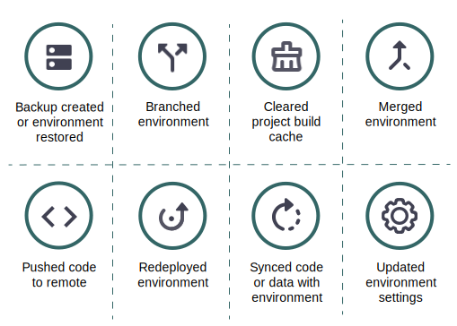

# Activiteitenstroom

De belangrijkste mening voor elk milieu toont een **lijst van de Activiteit** van historische gebeurtenissen gelijkend op een logboek van het Git. De lijst Activiteit is een stroom van de recente gebeurtenissen voor actieve milieu&#39;s. Hieronder volgt een lijst met de activiteitstypen en de bijbehorende pictogrammen die in de activiteitsstroom worden weergegeven:

{width="500" align="center"}

## Logboeken weergeven

Klik in de lijst Activiteit op het statuspictogram van een activiteit om het logboek weer te geven. Alternatief, klik {width="32"} (_meer_) menu om tot meer opties toegang te hebben om de activiteit te beheren. Hieronder ziet u een kort logboek waarin een back-up wordt gemaakt. U kunt [ CLI van de Wolk ](#activity-stream-with-cloud-cli) gebruiken om het zelfde logboek te bekijken.


## Een activiteit beheren

Sommige activiteiten zijn in a _lopende_ of _hangende_ status. U kunt op een lopende activiteit, zoals het annuleren van een lopende plaatsing handelen. In de volgende tabbladen ziet u twee methoden voor het annuleren van een activiteit: de [!DNL Cloud Console] of de Cloud CLI.

>[!BEGINTABS]

>[!TAB  Console ]

**om een activiteit in[!DNL Cloud Console]** te annuleren:

U kunt op een lopende activiteit handelen door tot {width="32"} (_meer_) menu toegang te hebben en een actie, zoals `Cancel` of `View log` te selecteren. Voor dit voorbeeld, selecteer **annuleer** optie om de lopende activiteit tegen te houden.

Niet alle activiteiten hebben de annuleringsoptie. Bijvoorbeeld, verschijnt de optie om de toepassingsplaatsing te annuleren slechts tijdens _bouwt_ fase. Zodra de toepassing in _is bewogen stel_ fase op, kunt u niet meer de activiteit annuleren. Zie [ proces van de Plaatsing ](../deploy/process.md) over de verschillende fasen.

{width="450" align="center"}

Als u een terminal hebt die de plaatsingsactiviteit in werking stelt, resulteert het annuleren in [!DNL Cloud Console] in de annulering in de terminal:

{width="300"}

>[!TAB  CLI ]

**om een activiteit in Cloud CLI** te annuleren:

1. Identificeer de lopende activiteiten en selecteer een activiteit-id.

   ```bash
   magento-cloud activity:list --state=in_progress
   ```

1. Annuleer de activiteit met de activiteit-id:

   ```bash
   magento-cloud activity:cancel wvl5wm7s5vkhy
   ```

>[!ENDTABS]

## Filter Activiteitsstroom

De mogelijkheid om de activiteitenlijst te filteren is nuttig wanneer u op zoek bent naar een specifieke gebeurtenis, zoals een back-up of een samenvoeggebeurtenis.

**om de activiteitenlijst in[!DNL Cloud Console]** te filtreren:

1. Selecteer een omgeving en kies de weergave Activiteit **[!UICONTROL All]** om de volledige gebeurtenisgeschiedenis op te nemen.

1. Klik {width="32"} en selecteer de **[!UICONTROL Filter by]** opties:

   

1. Kies de weergave Activiteit **[!UICONTROL Recent]** en stel de lijst opnieuw in.

## Stream weergeven met Cloud CLI

De CLI van `magento-cloud` verstrekt de meesten van de zelfde mogelijkheden zoals [!DNL Cloud Console]. Met de opdracht `activity` kunt u:

- `list` de activiteitenstroom voor een omgeving
- `get` details over een specifieke activiteit
- `log` weergeven voor een specifieke activiteit
- `cancel` een activiteit

**om de stroom van de Activiteit met Cloud CLI** te bekijken:

1. Vermeld de activiteiten voor de huidige omgeving.

   ```bash
   magento-cloud activity:list
   ```

1. Elke activiteit heeft een unieke id. Selecteer een id in de vorige lijst en bekijk de details voor die activiteit.

   ```bash
   magento-cloud activity:get wvl5wm7s5vkhy
   ```

1. Bekijk het volledige logboek voor die activiteit.

   ```bash
   magento-cloud activity:log wvl5wm7s5vkhy
   ```

   Monsterrespons:

   ```bash
   Activity ID: wvl5wm7s5vkhy
   Type: environment.backup
   Description: User created a backup of Master
   Created: 2023-09-08T14:03:33+00:00
   State: complete
   Log:
   Creating backup of master
   Created backup eg5pu63egt2dcojkljalzjdopa
   ```
