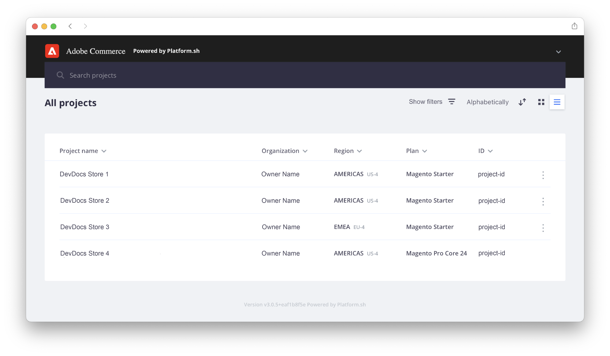

# Cloud-infrastructuurproject

Het Adobe Commerce on cloud Infrastructure-project bevat alle code in Git-vertakkingen, bijbehorende omgevingen en scripts om de [!DNL Commerce] -toepassing te implementeren. Omgevingen bevatten services die de [!DNL Commerce] -toepassing ondersteunen, zoals een database, webserver en caching-server.

Adobe beschikt over [!DNL Cloud Console] en ontwikkelaarsgereedschappen waarmee u alle aspecten van uw project volledig kunt beheren. U hebt als accounteigenaar volledige toegang tot alle omgevingen.

## [!DNL Cloud Console]

[!DNL Cloud Console] biedt interactieve methoden voor het maken, beheren en implementeren van Commerce-code in een gebruiksvriendelijke indeling. [&#x200B; Login aan  [!DNL Cloud Console] &#x200B;](https://console.adobecommerce.com) om uw projectlijst te bekijken. U kunt projecten slechts zien die u toestemming hebt om als admin of voor specifieke milieutypes toegang te hebben. Als u een Partner van de Oplossingen van Adobe bent, kunt u veelvoudige projecten voor cliënten zien die u steunt.

>[!TIP]
>
>Als u geen projecten ziet, moet u de [&#x200B; Eigenaar van de Rekening of Admin van het Project &#x200B;](../project/user-access.md) verbonden aan het project contacteren en toegang verzoeken. Voor eerste gebruikers, zie het [&#x200B; on boarding onderwerp &#x200B;](../../get-started/onboarding.md#cloud-console) in _begonnen_ gids krijgen.

De _Alle projecten_ mening maakt een lijst van alle projecten die u toestemming hebt om toegang te hebben. U kunt op **[!UICONTROL Show filters]** klikken en uw projectlijst filteren op type, gebied of plan.



### Overzicht van project

Het selecteren van een project van de _Alle projecten_ lijst opent het projectoverzicht. Het projectoverzicht toont altijd een bar van de projectnavigatie, die een milieuselecteur en een configuratieknoop omvat:


Het projectoverzicht, zolang u geen milieu hebt geselecteerd, toont een samenvatting van projectdetails in het voorproefgebied:

- Projectnaam
- Regio, project-id
- Plan, toegewezen opslag, omgevingen, gebruikers
- Storefront URL met knop **[!UICONTROL Set a custom domain]**

En in het hoofdprojectoverzicht:

- De mening van milieu&#39;s toont een lijst of boommening van {width="32"} (actief) en {width="32"} (inactieve) milieu&#39;s.
- [&#x200B; stroom van de Activiteit &#x200B;](activity-stream.md) toont lopende, hangende, en recente activiteiten voor het project.
<!-- - Apps & Services—Shows a topology of service containers -->

Voor **Starter** projecten, is er een hiërarchie van takken die van `master` (Productie) beginnen. Elke vertakking die u maakt, wordt weergegeven als onderliggende vertakking van de `master` -vertakking. Adobe raadt u aan een `staging` -vertakking te maken en vervolgens een `integration` -vertakking voor ontwikkeling te maken. Zie [&#x200B; architectuur van de Aanzet &#x200B;](../architecture/starter-architecture.md).

Voor **Pro**, is er een hiërarchie van takken die van `production` aan `staging` aan `integration` beginnen. Het {width="32"} pictogram wijst erop dat de tak aan een specifiek milieu opstelt. Alle vertakkingen die u maakt, worden weergegeven als onderliggende vertakkingen van de `integration` -vertakking. Zie [&#x200B; Pro architectuur &#x200B;](../architecture/pro-architecture.md).


### Overzicht van omgeving

Wanneer u een omgeving op de projectnavigatiebalk selecteert, veranderen het overzicht en de navigatiebalk zodat deze zich richten op de geselecteerde omgeving. De navigatiebalk bevat vertakkingsbesturingselementen (Vertakking, Samenvoegen en Synchroniseren) en een configuratieknop:


Het omgevingsoverzicht geeft een overzicht van de omgevingsdetails in het voorvertoningsgebied:

- Omgevingsnaam, type
- Regio, project-id
- Datum en tijdstip van laatste activiteit, inclusief back-up
- Status van HTTP-toegang en zoekmachine
- Machinenaam toegewezen aan omgeving
- Status van omgeving (actief of inactief)
- Storefront URL met knop **[!UICONTROL Set a custom domain]**

En in het belangrijkste milieu-overzicht:

- [&#x200B; de stroom van de Activiteit &#x200B;](activity-stream.md) maakt omhoog het belangrijkste milieu overzicht en toont lopend, in afwachting, en recente activiteiten voor het geselecteerde milieu.
<!-- - Services tab shows and Apps & Services menu, including overview and configuration tabs for each service. -->
- [&#x200B; het lusje van Steunen &#x200B;](../storage/snapshots.md#create-a-manual-backup) verstrekt een lijst van opgeslagen steunen, geschiedenis van reserveacties, en de Reserve knoop.

### Toegang opslagruimte

Elke actieve omgeving heeft een winkelcentrum. Selecteer een omgeving in de bovenste navigatie en klik op de URL in het omgevingsoverzicht. Er staat ook een **[!UICONTROL URLs]** lijst aan de rechterkant boven de lijst Activiteit.

De URL voor webtoegang kan het volgende bevatten:

```
https://<branch>-<unique-ID>-<project-ID>.<region>.magentosite.cloud/
```

- **Unieke identiteitskaart** = 7 willekeurige alpha-numerieke karakters
- **identiteitskaart van het Project** = 13-karakter project identiteitskaart
- **Gebied** = AWS of Azure gebiedsnaam, zie [&#x200B; Regionale IP adressen &#x200B;](regional-ip-addresses.md)

De milieu&#39;s van de Proproductie en van het Staging omvatten drie knopen die u tot het gebruiken van de volgende verbindingen kunt toegang hebben:

- URL van taakverdelingsmechanisme:

   - `http[s]://<your-domain>.c.<project-ID>.ent.magento.cloud`
   - `http[s]://<your-staging-domain>.c.<project-ID>.ent.magento.cloud`

- Directe toegang tot een van de drie redundante servers:

   - `http[s]://<your-domain>.{1|2|3}.<project-ID>.ent.magento.cloud`
   - `http[s]://<your-staging-domain>.{1|2|3}.<project-ID>.ent.magento.cloud`

  De productie-URL wordt gebruikt door het netwerk voor inhoudslevering (CDN).

## Instellingen

Open het _paneel van Montages_ door {width="36"} (vorm) pictogram op de rechterkant van de projectnavigatie.

### Projectinstellingen

**[!UICONTROL Project Settings]** breidt een menu van project-vlakke controles uit om gebruikers, variabelen, en meer te beheren:

| Optie | Beschrijving |
|--------------|-------------------------------------------------------------------------------------------------------------------------------|
| Algemeen | Beheer de tijdzone voor gebruik met het plannen van steunen of onderhoud. |
| Toegang | Beheer [&#x200B; gebruikerstoegang &#x200B;](user-access.md) aan project en omgevingstypes. |
| Certificaten | Een lijst weergeven met de SSL-certificaten die aan het project zijn gekoppeld. |
| Sleutel implementeren | Voeg en bekijk de openbare sleutel aan de bewaarplaats van de projectcode toe. |
| Domeinen | Voeg een domeinnaam aan het project toe. Zie [&#x200B; domeinen &#x200B;](../cdn/fastly-custom-cache-configuration.md#manage-domains) beheren. |
| Integraties | Voeg en beheer [&#x200B; integraties &#x200B;](../integrations/overview.md), zoals gezondheidsberichten en webhooks toe. |
| Variabelen | Voeg [&#x200B; project-vlakke variabelen &#x200B;](../environment/variable-levels.md) toe die bij bouwstijl en runtime in alle milieu&#39;s beschikbaar zijn. |

{style="table-layout:auto"}

### Omgevingsinstellingen

Klik op **[!UICONTROL Environments]** en selecteer een specifieke omgeving in de lijst voor besturingselementen voor het beheren van site-instellingen, omgevingsvariabelen en meer:

| Optie | Beschrijving |
| --------- | -------------------------------------------------------------------------------------------------------------------------------- |
| Algemeen | Configureer de weergavenaam, het omgevingstype en de bovenliggende omgeving.<br> Wissel verschillende omgevingsmontages in-/uitschakelen: |
|           | **laat uitgaande e-mails** toe: verzend [&#x200B; uitgaande e-mails &#x200B;](outgoing-emails.md) van het milieu gebruikend het protocol SMTP. |
|           | **Verbergen van onderzoeksmotoren**: De indexen en de kruipbewegingen van de onderzoekmachine van het blok van de plaats. |
|           | **de toegangscontrole van HTTP**: Laat veiligheidsconfiguratie voor [!DNL Cloud Console] toe gebruikend login en IP de controle van de adrestoegang. |
|           | De status is `active` of `inactive` . Het grootste deel van je werk is in een actieve omgeving. U kunt de omgeving deactiveren of verwijderen. |
| Variabelen | Bekijk, creeer, en beheer [&#x200B; milieu-vlakke variabelen &#x200B;](../environment/variable-levels.md) beschikbaar bij runtime. |
| Domeinen | Bekijk een lijst van [&#x200B; gevormde routes &#x200B;](../routes/routes-yaml.md). |

{style="table-layout:auto"}

>[!WARNING]
>
>**GEBRUIK NIET** de toegangsbeheermethode van HTTP voor het beveiligen van de milieu&#39;s van de ProStaging en van de Productie. Dit verbreekt snel caching. In plaats daarvan, gebruik de [&#x200B; Blokkerende &#x200B;](../cdn/fastly-vcl-blocking.md) eigenschap beschikbaar in Fastly CDN voor Adobe Commerce om toegang te blokkeren, of toegangsbeheer uit te voeren gebruikend [&#x200B; Snelle Basis Auth &#x200B;](https://github.com/fastly/fastly-magento2/blob/master/Documentation/Guides/BASIC-AUTH.md).

## Snelle en New Relic-gebruikersgegevens

Uw project omvat [&#x200B; &#x200B;](../cdn/fastly.md) en [&#x200B; snel New Relic &#x200B;](../monitor/new-relic-service.md). De projectdetails tonen informatie voor uw projectplan en belangrijke vergunningen en penningen voor deze integratie. Alleen de eigenaar van de licentie heeft initiële toegang tot de referenties en services. Geef deze gegevens desgewenst door aan de technische en ontwikkelaars.

- [&#x200B; snel &#x200B;](https://www.fastly.com/) verstrekt inhoudslevering (CDN), beeldoptimalisering, en de veiligheidsdiensten (DDoS en WAF) voor uw Adobe Commerce op de projecten van de wolkeninfrastructuur. Zie [&#x200B; krijgen de Snelle geloofsbrieven &#x200B;](../cdn/fastly-configuration.md#get-fastly-credentials).

- [&#x200B; New Relic &#x200B;](../monitor/new-relic-service.md) verstrekt toepassingsmetriek en prestatiesinformatie voor het Opvoeren en de milieu&#39;s van de Productie.

Gebruik [&#x200B; Cloud CLI &#x200B;](../dev-tools/cloud-cli-overview.md) om uw integratietokens, IDs, en meer te herzien:

```bash
magento-cloud subscription:info services
```
