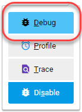

# Xdebug configureren

[!DNL Xdebug] is een extensie voor foutopsporing in uw PHP. Hoewel u IDE van uw keus kunt gebruiken, verklaart het volgende hoe te om [!DNL Xdebug] en [!DNL PhpStorm] te vormen om in uw lokale milieu te zuiveren.

>[!NOTE]
>
>U kunt [!DNL Xdebug] zo configureren dat deze wordt uitgevoerd in de Cloud Docker-omgeving voor lokale foutopsporing zonder de projectconfiguratie van de Adobe Commerce op de cloud-infrastructuur te wijzigen. Zie [&#x200B; Xdebug voor Docker &#x200B;](https://developer.adobe.com/commerce/cloud-tools/docker/test/configure-xdebug/) vormen.

Om [!DNL Xdebug] toe te laten, moet u een dossier in uw bewaarplaats van de it vormen, uw winde vormen, en de opstellingspoort door:sturen. U kunt bepaalde instellingen configureren in het `magento.app.yaml` -bestand. Nadat u de Git-wijzigingen hebt bewerkt, kunt u deze activeren door de Git-wijzigingen door te voeren in alle Starter-omgevingen en Pro-integratieomgevingen [!DNL Xdebug] . [!DNL Xdebug] is al beschikbaar in Pro Staging &amp; Production-omgevingen.

Zodra gevormd, kunt u bevelen CLI, Webverzoeken, en code zuiveren. Houd er rekening mee dat alle omgevingen met cloudinfrastructuren alleen-lezen zijn. Kloont de code aan uw lokale ontwikkelomgeving om het zuiveren uit te voeren. Voor Pro het Staging en de milieu&#39;s van de Productie, zie [&#x200B; extra instructies &#x200B;](#debug-for-pro-staging-and-production) voor [!DNL Xdebug].

## Vereisten

Als u [!DNL Xdebug] wilt uitvoeren en gebruiken, hebt u de SSH-URL voor de omgeving nodig. U kunt de informatie vinden via [[!DNL Cloud Console]](../project/overview.md) of de [!DNL Cloud Onboarding UI] .

## Xdebug configureren

Voer de volgende stappen uit om [!DNL Xdebug] te configureren:

- [In een vertakking werken om updates van bestanden door te voeren](#get-started-with-a-branch)
- [Laat  [!DNL Xdebug]  voor milieu&#39;s toe](#enable-xdebug-in-your-environment)
- [PHPStorm-server configureren](#configure-phpstorm-server)
- [Poorten doorsturen instellen](#set-up-port-forwarding)

### Aan de slag met een vertakking

Om [!DNL Xdebug] toe te voegen, adviseert de Adobe het werken in [&#x200B; een ontwikkelingstak &#x200B;](../dev-tools/cloud-cli-overview.md#create-an-environment-branch).

### Xdebug inschakelen in uw omgeving

U kunt [!DNL Xdebug] rechtstreeks inschakelen voor alle Starter-omgevingen en Pro-integratieomgevingen. Deze configuratiestap is niet vereist voor Pro Production &amp; Staging-omgevingen. Zie [&#x200B; zuiveren voor Pro het Opvoeren en de Productie &#x200B;](#debug-for-pro-staging-and-production).

>[!VIDEO](https://video.tv.adobe.com/v/3437407?learn=on)

Als u [!DNL Xdebug] wilt inschakelen voor uw project, voegt u `xdebug` toe aan de sectie `runtime:extensions` van het `.magento.app.yaml` -bestand.

**om Xdebug** toe te laten:

1. Open het bestand `.magento.app.yaml` in de lokale terminal in een teksteditor.

1. Voeg in de sectie `runtime` onder `extensions` toe `xdebug` . Bijvoorbeeld:

   ```yaml
   runtime:
       extensions:
           - redis
           - xsl
           - newrelic
           - sodium
           - xdebug
   ```

1. Sla de wijzigingen op in het `.magento.app.yaml` -bestand en sluit de teksteditor af.

1. Voeg de wijzigingen toe, begaan en duw deze om de omgeving opnieuw te implementeren.

   ```bash
   git add .magento.app.yaml
   ```

   ```bash
   git commit -m "add xdebug"
   ```

   ```bash
   git push origin <environment-ID>
   ```

Wanneer [!DNL Xdebug] wordt geïmplementeerd in Starter-omgevingen en Pro-integratieomgevingen, is het nu beschikbaar. Ga door met het configureren van uw IDE. Voor PHPStorm, zie [&#x200B; PHPStorm &#x200B;](#configure-phpstorm) vormen.

### PHPStorm-server configureren

>[!VIDEO](https://video.tv.adobe.com/v/3437409?learn=on)

[&#x200B; PpStorm &#x200B;](https://www.jetbrains.com/phpstorm/) winde moet worden gevormd om behoorlijk met [!DNL Xdebug] te werken.

**om PhpStorm te vormen om met Xdebug** te werken:

1. In uw project PhpStorm, open het **paneel van Montages**.

   - _macOS_ - selecteer **PHPStorm** > **Montages**.
   - _Vensters/Linux_ - selecteer **Dossier** > **Montages**.

1. In het _paneel van Montages_, breid **PHP** sectie uit en klik op **Servers**.

1. Klik **+** om een serverconfiguratie toe te voegen. De projectnaam is grijs bovenaan.

1. [ Facultatieve ] vorm de volgende montages voor de nieuwe serverconfiguratie. Zie [&#x200B; Geen zuivert server die &#x200B;](https://www.jetbrains.com/help/phpstorm/troubleshooting-php-debugging.html#no-debug-server-is-configured) in de _wordt gevormd PHPStorm_ documentatie.

   - **Naam** - ga het zelfde als hostname in. Deze waarde moet de waarde voor de `PHP_IDE_CONFIG` variabele in [&#x200B; aanpassen zuivert CLI bevelen &#x200B;](#debug-cli-commands) om CLI voor het zuiveren te gebruiken.
   - **Gastheer** - ga hostname in.
   - **Haven** - ga `443` binnen.
   - **Debugger** - selecteer `Xdebug`.

1. Selecteer **de wegafbeeldingen van het Gebruik**. In de _ruit van het Dossier/van de Folder_, de wortel van het project voor de `serverName` vertoningen.

1. In de **Absolute weg op de server** kolom, klik **geef** pictogram uit en voeg het plaatsen toe die op het milieu wordt gebaseerd.

   - Voor alle Starter-omgevingen en Pro-integratieomgevingen is het externe pad `/app` .
   - Voor Pro Staging- en Productieomgevingen:

      - Productie: `/app/<project_code>/`
      - Staging: `/app/<project_code>_stg/`

1. Verander de [!DNL Xdebug] haven in `9000,9003` of u kunt het beperken tot enkel `9000` in **PHP** > **zuiveren** > **Xdebug** > **zuivert het paneel van de Haven**.

1. Klik **toepassen**.

### De configuratie van PHPStorm Run/Debug maken

Hierdoor kan de toepassing de juiste foutopsporingsinstellingen hebben om de aanvraag van de Adobe Commerce-toepassing af te handelen.

>[!VIDEO](https://video.tv.adobe.com/v/3437426?learn=on)

1. Open de PHPStorm-toepassing en klik op **[!UICONTROL Add Configuration]** rechtsboven in het scherm.

1. Klik op **[!UICONTROL Add new run configuration]**.

1. Selecteer de optie **[!UICONTROL PHP Remote Debug]** .

   - Voer een unieke, maar herkenbare naam in.
   - Schakel het selectievakje [!UICONTROL Filter debug connection by IDE key]** in.
   - Selecteer de server die u in de [&#x200B; vorige sectie &#x200B;](#configure-phpstorm-server) creeerde. Als u het nog niet hebt gecreeerd, kunt u tot stand brengen nu, maar naar dat deel van de opstellingsgids verwijzen.
   - Typ `PHPSTORM` in hoofdletters in het tekstveld **[!UICONTROL IDE key(session id)]** . We zullen dit in andere delen van de opstelling gebruiken, dus het is belangrijk om dit te handhaven. Als u een ander koord kiest, moet u zich herinneren om het elders in de opstelling en het configuratieproces te gebruiken.

1. Klik op **[!UICONTROL Apply]** > **[!UICONTROL OK]** .

### Poorten doorsturen instellen

>[!VIDEO](https://video.tv.adobe.com/v/3437410?learn=on)

Wijs de `XDEBUG` verbinding van de server aan uw lokaal systeem toe. Voor elk type foutopsporing moet u poort 9000 van uw Adobe Commerce op de server van de cloudinfrastructuur doorsturen naar uw lokale computer. Zie een van de volgende secties:

- [Poorten doorsturen in Mac of UNIX](#port-forwarding-on-mac-or-unix)
- [Poorten doorsturen in Windows](#port-forwarding-on-windows)

#### Poorten doorsturen op Mac of UNIX®

**aan opstellingshaven die op een Mac of in een milieu UNIX®** door:sturen:

1. Open een terminal.

1. Gebruik SSH om de verbinding te maken.

   ```bash
   ssh -R 9000:localhost:9000 <ssh url>
   ```

   Gebruik de optie `-v` (verbose) zodat wanneer een socket is verbonden met de poort die wordt doorgestuurd, deze in de terminal wordt weergegeven.

   Als een &quot;onbekwaam om&quot;te verbinden of &quot;niet aan haven op verre&quot;fout kon luisteren wordt getoond, kon er een andere actieve zitting van SSH die op de server voortduurt die haven 9000 bezet. Als die verbinding niet wordt gebruikt, kunt u het eindigen.

**om de verbinding** problemen op te lossen:

1. Gebruik SSH om u aan te melden bij de externe integratie, staging of productieomgeving.

1. Een lijst met SSH-sessies weergeven: `who`

1. Bestaande SSH-sessies op gebruiker weergeven. Wees voorzichtig dat u geen andere gebruiker aangaat dan uzelf!

   - integratie: gebruikersnamen zijn vergelijkbaar met `dd2q5ct7mhgus`
   - Staging: gebruikersnamen zijn vergelijkbaar met `dd2q5ct7mhgus_stg`
   - Productie: gebruikersnamen zijn vergelijkbaar met `dd2q5ct7mhgus`

1. Voor een gebruikerszitting die ouder is dan van u, vind de pseudo-terminal (PTS) waarde, zoals `pts/0`.

1. Vernietig de proces-id (PID) die overeenkomt met de PTS-waarde.

   ```bash
   ps aux | grep ssh
   kill <PID>
   ```

   Monsterrespons:

   ```
   dd2q5ct7mhgus        5504  0.0  0.0  82612  3664 ?      S    18:45   0:00 sshd: dd2q5ct7mhgus@pts/0
   ```

   Om de verbinding te eindigen, ga een doodbevel met procesidentiteitskaart (PID) in.

   ```bash
   kill 3664
   ```

#### Poorten doorsturen in Windows

Aan opstellingshaven door:sturen (het een tunnel graven van SSH) op Vensters, moet u uw eindtoepassing van Vensters vormen. Dit voorbeeldstappen door een tunnel van SSH tot stand te brengen gebruikend [&#x200B; Putty &#x200B;](https://www.chiark.greenend.org.uk/~sgtatham/putty/latest.html). U kunt andere toepassingen gebruiken, zoals Cygwin. Raadpleeg de documentatie van de leverancier bij deze toepassingen voor meer informatie over andere toepassingen.

**aan opstelling een tunnel van SSH op Vensters gebruikend Putty**:

1. Als u dit nog niet hebt gedaan, download [&#x200B; Putty &#x200B;](https://www.chiark.greenend.org.uk/~sgtatham/putty/latest.html).

1. Start Putty.

1. In de ruit van de Categorie, klik **Zitting**.

1. Voer de volgende gegevens in:

   - **Hostname (of IP adres)** gebied: Ga [&#x200B; SSH URL &#x200B;](../development/secure-connections.md#connect-to-a-remote-environment) voor uw server van de Wolk in
   - **Poort** gebied: Ga `22` binnen

   

1. In de _ruit van de Categorie_, klik **Verbinding** > **SSH** > **Tunnels**.

1. Voer de volgende gegevens in:

   - **Source haven** gebied: Ga `9000` binnen
   - **Doel** gebied: Ga `127.0.0.1:9000` binnen
   - Klik **Verre**

1. Klik **toevoegen**.

   

1. In de _ruit van de Categorie_, klik **Zitting**.

1. Op het **Bewaarde gebied van Zittingen**, ga een naam voor deze tunnel van SSH in.

1. Klik **sparen**.

   

1. Om de tunnel van SSH te testen, klik **Lading**, dan klik **Open**.

   Als de fout &quot;Kan geen verbinding maken&quot; wordt weergegeven, controleert u het volgende:

   - Alle instellingen voor Putty zijn correct
   - U gebruikt Putty op de computer waarop uw privé Adobe Commerce op de sleutels van de de infrastructuurSSH van de wolkeninfrastructuur wordt gevestigd

## SSH-toegang tot Xdebug-omgevingen

Voor het in werking stellen van het zuiveren, het uitvoeren van opstelling, en meer, hebt u de bevelen van SSH voor de toegang tot van de milieu&#39;s nodig. U kunt deze informatie door [[!DNL Cloud Console]](../development/secure-connections.md#use-an-ssh-command) en uw projectspreadsheet krijgen.

Voor Starter-omgevingen en Pro-integratieomgevingen kunt u de volgende `magento-cloud` CLI-opdracht gebruiken om SSH in die omgevingen te gebruiken:

```bash
magento-cloud environment:ssh --pipe -e <environment-ID>
```

Om [!DNL Xdebug] te gebruiken, SSH aan het milieu als volgt:

```bash
ssh -R <xdebug listen port>:<host>:<xdebug listen port> <SSH-URL>
```

Bijvoorbeeld:

```bash
ssh -R 9000:localhost:9000 pwga8A0bhuk7o-mybranch@ssh.us.magentosite.cloud
```

## Foutopsporing voor Pro Staging en Production

>[!NOTE]
>
>In Pro Staging &amp; Production-omgevingen is [!DNL Xdebug] altijd beschikbaar omdat deze omgevingen een speciale installatie hebben voor [!DNL Xdebug] . Alle normale webaanvragen worden gerouteerd naar een speciaal PHP-proces zonder [!DNL Xdebug] . Deze aanvragen worden daarom op de normale manier verwerkt en zijn niet onderhevig aan de prestatievermindering wanneer [!DNL Xdebug] wordt geladen. Wanneer een webaanvraag wordt verzonden die de sleutel [!DNL Xdebug] heeft, wordt deze gerouteerd naar een afzonderlijk PHP-proces dat [!DNL Xdebug] heeft geladen.

Als u [!DNL Xdebug] specifiek wilt gebruiken in de Pro-omgeving voor Staging en Productie van abonnementen, maakt u een aparte SSH-tunnel en websessie waartoe alleen u toegang hebt. Dit gebruik verschilt van typische toegang, die slechts toegang tot u en niet aan alle gebruikers verleent.

U hebt het volgende nodig:

- SSH-opdrachten voor toegang tot de omgevingen. U kunt deze gegevens ophalen via de [[!DNL Cloud Console]](../project/overview.md) of de [!DNL Cloud Onboarding UI] .
- De `xdebug_key` -waarde die is ingesteld bij het configureren van de Staging- en Pro-omgevingen.

  De `xdebug_key` kan worden gevonden door SSH te gebruiken om zich aan te melden bij het primaire knooppunt en het uitvoeren:

  ```bash
  cat /etc/platform/*/nginx.conf | grep xdebug.sock | head -n1
  ```

**aan opstelling een tunnel SSH aan een het Opvoeren of milieu van de Productie**:

1. Open een terminal.

1. Maak alle SSH-sessies op voor elk webknooppunt van de cluster.

   ```bash
   ssh USERNAME@CLUSTER.ent.magento.cloud 'rm /run/platform/USERNAME/xdebug.sock'
   ```

1. Opstelling de tunnel van SSH voor Xdebug voor elke Webknoop van de cluster.

   ```bash
   ssh -R /run/platform/USERNAME/xdebug.sock:localhost:9000 -N USERNAME@CLUSTER.ent.magento.cloud
   ```

>[!NOTE]
>
>U kunt als volgt de juiste waarde voor `USERNAME@CLUSTER.ent.magento.cloud` verkrijgen:
>- Methode 1: magento-cloud CLI: `magento-cloud ssh --all`
>- Methode 2: Commerce Console: https://CONSOLE-URL/ENVIRONMENT, klik `SSH v` dropdown

**beginnen het zuiveren gebruikend het milieu URL**:

Dit is een demonstratie van de gebruikte configuraties evenals een demonstratie van de parameter van de GET om een verre het zuiveren zitting te beginnen.

>[!VIDEO](https://video.tv.adobe.com/v/3437417?learn=on)

1. Foutopsporing op afstand inschakelen; ga naar de site in de browser en voeg het volgende toe aan de URL waar `KEY` de waarde voor `xdebug_key` is.

   ```http
   ?XDEBUG_SESSION_START=KEY
   ```

   Met deze stap stelt u het cookie in dat browserverzoeken verzendt om [!DNL Xdebug] te activeren.

1. Voltooi de foutopsporing met [!DNL Xdebug] .

1. Wanneer u klaar bent om de sessie te beëindigen, gebruikt u de volgende opdracht om de cookie te verwijderen en de foutopsporing te beëindigen via de browser waar `KEY` de waarde voor `xdebug_key` is.

   ```http
   ?XDEBUG_SESSION_STOP=KEY
   ```

   >[!NOTE]
   >
   >De `XDEBUG_SESSION_START` die door `POST` -aanvragen wordt doorgegeven, worden niet ondersteund.

## Foutopsporing CLI-opdrachten

Deze sectie loopt door het zuiveren bevelen CLI.

Om CLI bevelen te zuiveren:

1. SSH in de server u wilt zuiveren gebruikend bevelen CLI.

1. Maak de volgende omgevingsvariabelen:

   ```bash
   export XDEBUG_CONFIG='PHPSTORM'
   ```

   ```bash
   export PHP_IDE_CONFIG="serverName=<name of the server that is configured in PHPSTORM>"
   ```

   Deze variabelen worden verwijderd wanneer de SSH-sessie wordt beëindigd.

1. Foutopsporing starten

   Bij Starter-omgevingen en Pro-integratieomgevingen voert u de CLI-opdracht uit om fouten op te sporen.
U kunt bijvoorbeeld runtime-opties toevoegen:

   ```bash
   php -d xdebug.profiler_enable=On -d xdebug.max_nesting_level=9999 bin/magento cache:clean
   ```

   In een Pro Staging- en Production-omgeving moet u het pad naar het [!DNL Xdebug] PHP-configuratiebestand opgeven wanneer u foutopsporing uitvoert voor CLI-opdrachten, bijvoorbeeld:

   ```bash
   php -c /etc/platform/USERNAME/php.xdebug.ini bin/magento cache:clean
   ```

## Fouten opsporen in webverzoeken

De volgende stappen helpen u Webverzoeken zuiveren.

1. Voor het _menu van de Uitbreiding_, klik **zuivert** om toe te laten.

1. Klik met de rechtermuisknop, selecteer het optiemenu en stel de IDE-sleutel in op **PHPSTORM** .

1. Installeer de [!DNL Xdebug] -client in de browser. Vorm en laat het toe.

### Voorbeeld: Chrome instellen

In deze sectie wordt beschreven hoe u [!DNL Xdebug] in Chrome kunt gebruiken met de extensie [!DNL Xdebug] Helper. Raadpleeg de documentatie van de browser voor informatie over [!DNL Xdebug] -gereedschappen voor andere browsers.

**om Helper Xdebug met Chrome** te gebruiken:

1. Creeer een [&#x200B; tunnel van SSH &#x200B;](#ssh-access-to-xdebug-environments) aan de server van de Wolk.

1. Installeer de [&#x200B; uitbreiding van de Helper Xdebug &#x200B;](https://chromewebstore.google.com/detail/eadndfjplgieldjbigjakmdgkmoaaaoc) van de opslag van Chrome.

1. Schakel de extensie in Chrome in zoals in de volgende afbeelding.

    toe

1. Klik in Chrome met de rechtermuisknop op het groene hulppictogram op de Chrome-werkbalk.

1. Van pop-up menu, klik **Opties**.

1. Van de _Belangrijke winde_ lijst, klik **PhpStorm**.

1. Klik **sparen**.

   

1. Open uw PhpStorm-project.

1. In de hoogste navigatiebar, klik het **Begin luisterend** pictogram.

   Als de navigatiebar niet wordt getoond, klik **Mening** > **de Bar van de Navigatie**.

1. Dubbelklik in het navigatievenster PHP op het PHP-bestand dat u wilt testen.

## Lokale code debuggen

Wegens de read-only milieu&#39;s, moet u code aan het lokale werkstation van een milieu of specifieke tak van de it trekken om het zuiveren uit te voeren.

De methode die u kiest, is aan u. U hebt de volgende opties:

- Code uitchecken vanuit Git en uitvoeren `composer install`

  Deze methode werkt alleen als `composer.json` verwijst naar pakketten in privéopslagruimten waartoe u geen toegang hebt. Met deze methode krijgt u de volledige Adobe Commerce-codebase.

- Kopieer de mappen `vendor` , `app` , `pub` , `lib` en `setup` .

  Deze methode leidt ertoe dat u alle code hebt die u mogelijk kunt testen. Afhankelijk van het aantal statische elementen waarover u beschikt, kan dit resulteren in een lange overdracht met een groot volume bestanden.

- Alleen de map `vendor` kopiëren

  Omdat het grootste deel van de code zich in de map `vendor` bevindt, zal deze methode waarschijnlijk resulteren in goede tests, hoewel de volledige codebase niet wordt getest.

**om dossiers te comprimeren en hen te kopiëren aan uw lokale machine**:

1. Gebruik SSH om u aan te melden bij de externe omgeving.

1. Comprimeer de bestanden.

   ```bash
   tar -czf /tmp/<file-name>.tgz <directory list>
   ```

   Als u bijvoorbeeld alleen de map `vendor` wilt comprimeren:

   ```bash
   tar -czf /tmp/vendor.tgz vendor
   ```

1. Gebruik PHPStorm in uw lokale omgeving om de bestanden te comprimeren.

   ```bash
   cd <phpstorm project root dir>
   ```

   ```bash
   rsync <SSH-URL>:/tmp/<file-name>.tgz .
   ```

   ```bash
   tar xzf <file-name>.tgz
   ```
